# BharatPass — Project Documentation 🚌

> A digital transit pass management system replacing paper-based bus/train passes with secure QR codes. Built as a college project demonstrating full-stack web development with role-based access control.

---

## Table of Contents
1. [Features](#features)
2. [Tech Stack](#tech-stack)
3. [System Architecture](#system-architecture)
4. [Core Components](#core-components)
5. [Data Model](#data-model)
6. [Application Workflow](#application-workflow)
7. [API Reference](#api-reference)
8. [Deployment](#deployment)
9. [Project Structure](#project-structure)
10. [Demo Credentials](#demo-credentials)

---

## Features

### 👤 User (Passenger) Features
| Feature | Description |
|---|---|
| **Self-Registration / Login** | Secure login with role-based redirect |
| **Apply for Pass** | Choose route, pass type (Monthly / Quarterly / Yearly), and pay |
| **View My Passes** | See all active, pending, and expired passes |
| **Download QR Code** | Each valid pass generates a unique QR code |
| **Payment Simulation** | Simulated payment flow before pass activation |

### 🛡️ Admin Features
| Feature | Description |
|---|---|
| **Dashboard Overview** | Statistics: total users, passes, revenue |
| **Manage Users** | View all users, their roles, and registration dates |
| **Manage Passes** | Approve / Reject pending passes, view all pass records |
| **Revenue Reports** | Total revenue, pass-type breakdown |
| **Scan Logs** | View all conductor scan history |

### 🎫 Conductor Features
| Feature | Description |
|---|---|
| **QR Scanner** | Camera-based QR scanning using device webcam |
| **Real-time Validation** | Instantly checks if pass is valid, expired, or rejected |
| **Scan History** | Log of all scans performed in the current session |

### 🎨 UI/UX Features
| Feature | Description |
|---|---|
| **Dark / Light Mode** | Persistent theme toggle across all pages |
| **Glassmorphism Design** | Modern frosted-glass card aesthetic |
| **Responsive Layout** | Works on mobile and desktop |
| **Toast Notifications** | Contextual success / error / info toasts |
| **Tab-based Navigation** | Clean tabbed dashboards for each role |

---

## Tech Stack

```
┌──────────────────────────────────────────────────────────────┐
│                        FRONTEND                              │
│  HTML5 + Vanilla JavaScript + Vanilla CSS (Glassmorphism)    │
│  📁 /public/                                                 │
├──────────────────────────────────────────────────────────────┤
│                       BACKEND (LOCAL)                        │
│  Node.js + Express.js                                        │
│  📄 server.js  →  GET /api/qr                                │
├──────────────────────────────────────────────────────────────┤
│                   BACKEND (PRODUCTION)                       │
│  Netlify Serverless Functions                                │
│  📄 netlify/functions/qr.js  →  /.netlify/functions/qr       │
├──────────────────────────────────────────────────────────────┤
│                  DATA PERSISTENCE (DEMO)                     │
│  Browser localStorage (simulated database)                   │
├──────────────────────────────────────────────────────────────┤
│                     CORE LIBRARY                             │
│  qrcode (npm) — QR code image generation                     │
└──────────────────────────────────────────────────────────────┘
```

| Layer | Technology | Purpose |
|---|---|---|
| **Frontend** | Vanilla HTML, CSS, JavaScript | UI rendering, user interaction |
| **Styling** | Custom CSS (Glassmorphism, CSS Variables) | Dark/light theming, animations |
| **Local Server** | Node.js + Express | Static file serving + QR API (dev) |
| **Serverless** | Netlify Functions | QR code generation endpoint (prod) |
| **Data Store** | `localStorage` | In-browser simulated DB (demo mode) |
| **QR Library** | `qrcode` npm package | Converts pass data → QR image |
| **Hosting** | Netlify | Static site + serverless deployment |

---

## System Architecture

### High-Level Architecture


### Authentication & Role Routing


---

## Core Components

### 1. `public/js/app.js` — Shared Utilities
This is the **central shared library** included in every page. It provides:

| Function | Purpose |
|---|---|
| `getDB()` / `saveDB()` | Read/write the simulated localStorage database |
| `resetDB()` | Restore the database to seed/default state |
| `getSession()` / `setSession()` / `clearSession()` | Manage current login session |
| `requireAuth(role)` | Guard pages — redirect if not logged in or wrong role |
| `generateToken()` | Create unique `QRP-XXXXXXXXXXXX` token for each pass |
| `generateId(prefix)` | Generate unique IDs for new records |
| `toggleTheme()` | Switch between dark/light mode, persisted in localStorage |
| `showToast(msg, type)` | Display animated notification banners |
| `initSidebar()` | Populate the sidebar with user info |
| `initTabs()` | Enable tab switching in dashboard pages |
| `openModal(id)` / `closeModal(id)` | Control modal dialogs |
| `formatDate()` / `formatDateTime()` | Indian locale date/time formatting |
| `isExpired(dateStr)` | Check if a pass validity date has passed |
| `getPassPrice(type)` / `getPassDuration(type)` | Map pass type → price/duration |

---

### 2. `public/index.html` — Landing / Home Page
- Public-facing landing page
- Presents the product features, demo credentials, and CTA button to login
- No authentication required

---

### 3. `public/login.html` — Login Page
- Accepts email and password
- Validates against the `users` array in `localStorage` DB
- Sets session and redirects based on role
- No registration (demo: pre-seeded users only)

---

### 4. `public/user/dashboard.html` — Passenger Dashboard


**Features:**
- **My Passes**: Lists all passes (active / pending / expired) with badge indicators
- **Apply for Pass**: Select route, pass type — shows price preview
- **Payment Flow**: Modal simulates UPI/card payment before creating the pass record
- **QR Code**: Calls the QR API to render the pass as a scannable image

---

### 5. `public/admin/dashboard.html` — Admin Dashboard


**Features:**
- **Stats cards**: Total users, total passes, active passes, total revenue
- **Users list**: Name, email, role, join date
- **Passes management**: Approve (sets validFrom/validUntil, generates QR token) or Reject
- **Scan Logs**: Complete history of conductor scans with result outcomes

---

### 6. `public/conductor/scanner.html` — Conductor Scanner

```mermaid
sequenceDiagram
    participant C as Conductor
    participant UI as Scanner Page
    participant Cam as Device Camera
    participant DB as localStorage DB

    C->>UI: Open scanner page
    UI->>Cam: Request camera access
    Cam-->>UI: Video stream
    C->>UI: Present passenger's QR code
    UI->>UI: Decode QR frame (jsQR)
    UI->>DB: Lookup pass by token
    DB-->>UI: Pass record
    UI->>UI: Validate (active? expired? route match?)
    UI-->>C: Show result (✅ Valid / ❌ Expired / 🚫 Invalid)
    UI->>DB: Save scan log
```



**Features:**
- Live camera feed using the browser's `getUserMedia` API
- Frame-by-frame QR decoding via **jsQR** library (loaded from CDN)
- Displays result card with passenger name, route, validity dates
- Appends every scan to the `scanLogs` collection in localStorage

---

### 7. `server.js` — Local Development Server

```
Express App
├── Static → serves /public/* files
├── GET /api/qr?token=&size=&passId=&route=&name=
│     └── Uses `qrcode` npm package
│     └── Returns { qrDataUrl: "data:image/png;base64,..." }
└── GET /api/health
      └── Returns { status: "ok", time: "..." }
```

---

### 8. `netlify/functions/qr.js` — Serverless QR Endpoint

Same logic as the Express route, but packaged as a Netlify Function. Handles CORS headers to allow browser fetch from any origin.

**Endpoint:** `GET /.netlify/functions/qr`

**Query Parameters:**

| Parameter | Required | Description |
|---|---|---|
| `token` | ✅ Yes | The pass's unique QR token |
| `size` | Optional | QR image size in pixels (default: 200) |
| `passId` | Optional | Pass ID embedded in QR data |
| `route` | Optional | Route embedded in QR data |
| `name` | Optional | Passenger name embedded in QR data |
| `validFrom` | Optional | Start date embedded in QR data |
| `validUntil` | Optional | Expiry date embedded in QR data |
| `status` | Optional | Pass status embedded in QR data |

**QR Code Payload** (JSON encoded inside the QR):
```json
{
  "token": "QRP-ABCDEFGHIJKL",
  "passId": "p1",
  "route": "Andheri ↔ Dadar",
  "name": "Rahul Sharma",
  "validFrom": "2026-02-01",
  "validUntil": "2026-03-15",
  "status": "active"
}
```

---

## Data Model

All data lives in the browser's `localStorage` under the key `bharatpass_db`.


### Pass Status Lifecycle


### Pass Types

| Type | Duration | Price |
|---|---|---|
| Monthly | 30 days | ₹450 |
| Quarterly | 90 days | ₹1,200 |
| Yearly | 365 days | ₹4,500 |

---

## Application Workflow

### End-to-End User Journey

```mermaid
sequenceDiagram
    actor User
    actor Admin
    actor Conductor
    participant System as BharatPass System

    User->>System: Login (user@pass.com)
    System-->>User: Redirect to User Dashboard

    User->>System: Apply for Pass (route + type)
    System-->>User: Show payment modal
    User->>System: Confirm payment
    System-->>User: Pass created (status: pending)

    Admin->>System: Login (admin@pass.com)
    System-->>Admin: Redirect to Admin Dashboard
    Admin->>System: View pending passes
    Admin->>System: Approve pass
    System-->>Admin: Pass activated (dates set, QR token generated)

    User->>System: View My Passes
    System-->>User: Show QR code image
    User->>Conductor: Show QR code on phone

    Conductor->>System: Login (conductor@pass.com)
    System-->>Conductor: Redirect to Scanner
    Conductor->>System: Scan QR code
    System-->>Conductor: Validate & show result (✅ Valid)
    System->>System: Save scan log
```



---

## API Reference

### Local Dev Server

| Method | Endpoint | Description |
|---|---|---|
| `GET` | `/api/qr` | Generate QR code image |
| `GET` | `/api/health` | Server health check |
| `GET` | `/` | Serves `index.html` |
| `GET` | `/*` | Serves any file from `/public/` |

### Production (Netlify)

| Method | Endpoint | Description |
|---|---|---|
| `GET` | `/.netlify/functions/qr` | Generate QR code image (serverless) |
| `OPTIONS` | `/.netlify/functions/qr` | CORS preflight response |

---

## Deployment

### Local Setup

```bash
# 1. Install dependencies
npm install

# 2. Start the Express server
npm start

# 3. Open in browser
# http://localhost:3000
```

### Production (Netlify)

The project deploys to Netlify as a **static site with serverless functions**.

**`netlify.toml` configuration:**
```toml
[build]
  publish = "public"
  functions = "netlify/functions"

[[redirects]]
  from = "/api/qr"
  to = "/.netlify/functions/qr"
  status = 200
```

> The redirect ensures the same `/api/qr` URL used in development resolves to the Netlify function in production — no frontend code changes needed.

---

## Project Structure

```
qr-pass-system/
│
├── public/                  # All static frontend files
│   ├── index.html           # Landing page
│   ├── login.html           # Login page (all roles)
│   │
│   ├── user/
│   │   └── dashboard.html   # Passenger dashboard
│   │
│   ├── admin/
│   │   └── dashboard.html   # Admin control panel
│   │
│   ├── conductor/
│   │   └── scanner.html     # QR scanner for conductors
│   │
│   ├── js/
│   │   └── app.js           # Shared JS utilities (auth, DB, UI)
│   │
│   └── css/
│       └── style.css        # Global styles + theme variables
│
├── netlify/
│   └── functions/
│       └── qr.js            # Netlify serverless QR function (prod)
│
├── server.js                # Express server (local dev)
├── netlify.toml             # Netlify build + redirect config
└── package.json             # Dependencies (express, qrcode)
```

---

## Demo Credentials

| Role | Email | Password | Dashboard |
|:---|:---|:---|:---|
| **Admin** | `admin@pass.com` | `demo123` | `/admin/dashboard.html` |
| **User (Passenger)** | `user@pass.com` | `demo123` | `/user/dashboard.html` |
| **Conductor** | `conductor@pass.com` | `demo123` | `/conductor/scanner.html` |

> **Note:** All data is stored in the browser's `localStorage`. Clearing site data will reset the database to its default seed state.

---

*Developed as a college project — BharatPass | 2026*
